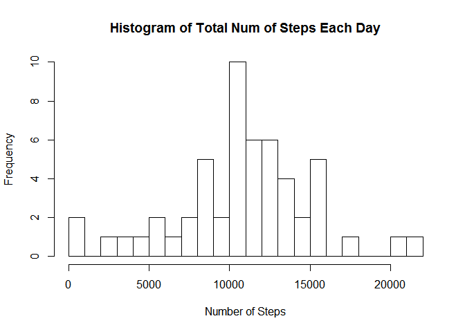
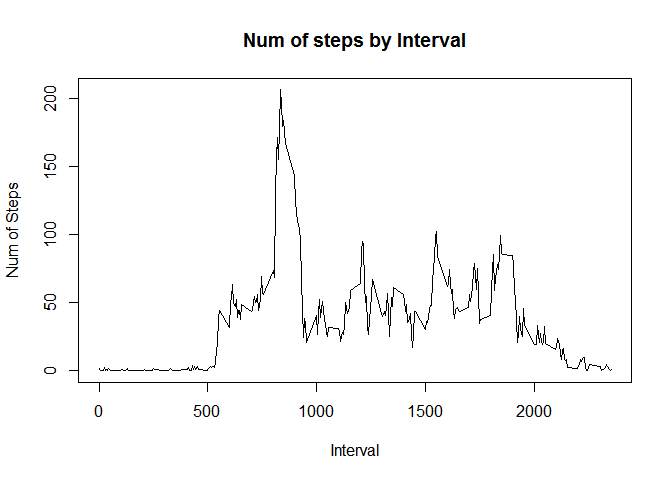
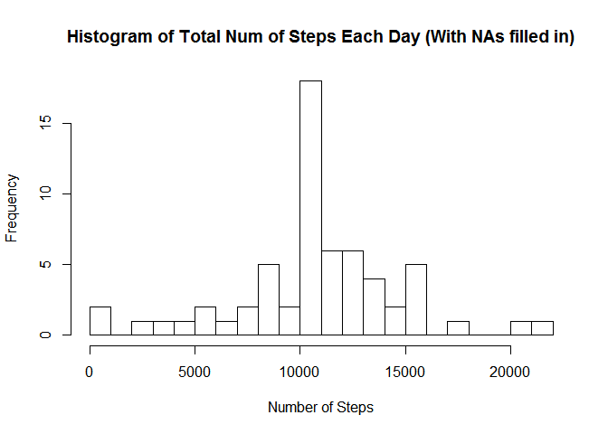
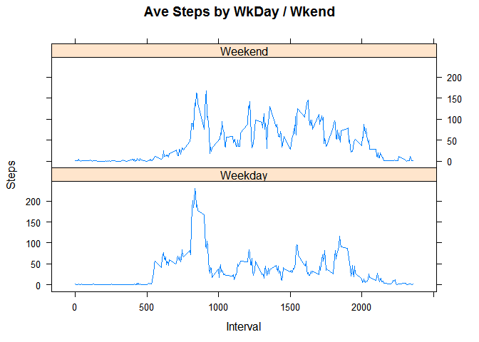

# Reproducible Research: Peer Assessment 1


## Loading and preprocessing the data

```r
unzip("activity.zip")
activity_data  <-  read.csv("activity.csv")
```


## What is mean total number of steps taken per day?

```r
totalsteps <- aggregate(steps~date,activity_data,sum)
hist(totalsteps$steps, breaks=20, main="Histogram of Total Num of Steps Each Day", xlab="Number of Steps")
```

 

```r
tsmean <- mean(totalsteps$steps)
tsmedian <- median(totalsteps$steps)
```
The mean of the total number of steps is 1.0766189\times 10^{4} and the median is 10765.


## What is the average daily activity pattern?

```r
stepint <- aggregate(steps~interval,activity_data,mean)
plot(stepint[,1],stepint[,2],type="l",main="Num of steps by Interval",xlab="Interval",ylab="Num of Steps")
```

 

```r
maxstep <- stepint[which.max(stepint[,2]),1]
```
The interval with the maximum number of steps is 835.


## Imputing missing values

```r
narows <- sum(is.na(activity_data))
newdata <- transform(activity_data,steps=ifelse(is.na(activity_data$steps),stepint$steps[match(activity_data$interval,stepint$interval)],activity_data$steps))
```
1) The number of rows with NAs is 2304.
2) Since we calculated the average number of steps for each days interval, we shall just replace the NA values with the mean.


```r
totalnewsteps <- aggregate(steps~date,newdata,sum)
hist(totalnewsteps$steps, breaks=20, main="Histogram of Total Num of Steps Each Day (With NAs filled in)", xlab="Number of Steps")
```

 

```r
tsnewmean <- mean(totalnewsteps$steps)
tsnewmedian <- median(totalnewsteps$steps)

Diffmean  <- tsmean - tsnewmean
Diffmedian <- tsmedian - tsnewmedian
```
The New Mean and Median Values are 1.0766189\times 10^{4} and 1.0766189\times 10^{4}.

The difference of the New Values with the Previous one is 0 and -1.1886792.

Imputing missing data affects the median value.

## Are there differences in activity patterns between weekdays and weekends?

```r
wkend <- c("Saturday","Sunday")
newdata$Day <- as.factor(ifelse(is.element(weekdays(as.Date(newdata$date)),wkend),"Weekend","Weekday"))

stepsbywk <- aggregate(steps~interval+Day,newdata,mean)
        
library(lattice)
xyplot(stepsbywk$steps~stepsbywk$interval|stepsbywk$Day,layout=c(1,2),type='l',main="Ave Steps by WkDay / Wkend",xlab="Interval",ylab="Steps")
```

 
